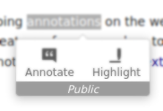
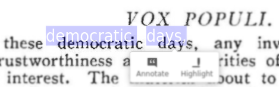
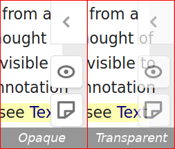
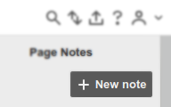

Extra features
======================

The Unofficial extension for Hypothesis enables some customization of the annotation
client. Some of the configuration settings are supported by the official client and
the unofficial extension simply lets you configure them. Others are experimental features
only [supported][unofficial-client-config] by the unofficial client which the unofficial
extension uses.

[unofficial-client-config]: https://github.com/diegodlh/unofficial-hypothesis-client#client-configuration

To change these settings, right-click the extension's button and click *Settings*.

Remember to reload the tabs you are annotating for the changes to take effect. In the
future, some of these settings may be moved to the client's sidebar for easier
configuration.

This is the list of currently supported features. I already have other ideas in mind
and I will be posting them [here][unofficial-ext-issues], and implementing them as time allows. Feel free to
contribute your ideas as well!

[unofficial-ext-issues]: https://github.com/diegodlh/unofficial-hypothesis-extension/issues

#### Display current group name below the annotation adder

When saving an annotation it is easy to tell from the sidebar what annotation group it 
will be posted to. But when saving a highlight the sidebar remains closed and it may be
unknowingly posted to the wrong group.

This experimental feature shows the currently selected group name on the annotation adder
toolbar.

Choose “Except Public” to only show the group name if the currently selected group is not 
the “Public” group.

#### Make PDF overlay text white to aid in selection
Hypothesis uses PDF.js to annotate PDFs. This viewer renders PDF documents as images of 
the pages with a transparent layer of selectable text on top. Usually image and text 
layers align perfectly. But sometimes (especially with scanned PDFs) they don’t and it 
is hard to know exactly what is being selected for annotation. 

This experimental feature shows the selected text in white for more accurate selection.

#### Transparent sidebar toolbar buttons

The toolbar buttons may cover page content, especially at the top right corner of the 
document. 

This experimental feature (originally proposed [here][sidebar-buttons-transparent]) makes
these buttons transparent.

[sidebar-buttons-transparent]: https://github.com/hypothesis/client/pull/1169

#### Enable experimental New Page-Note button

This enables setting the official `enableExperimentalNewNoteButton` config param from the
browser extension.

It adds a “New note” button in the Page Notes section of the sidebar. This button provides the 
same functionality as the toolbar “New page note” button.

#### Open sidebar automatically on startup

This enables setting the official `openSidebar` config param from the browser extension.

It opens the annotation sidebar automatically when the extension is activated.

